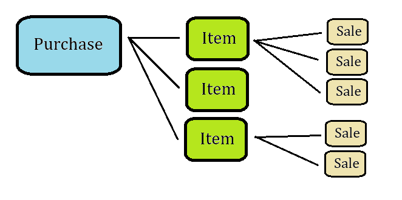
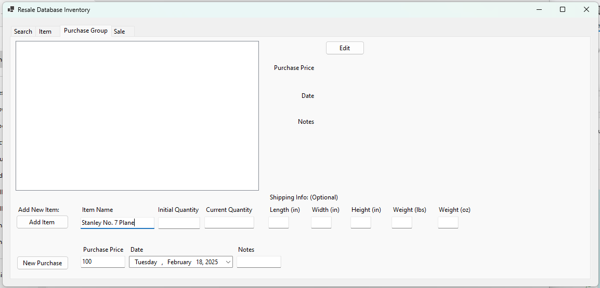
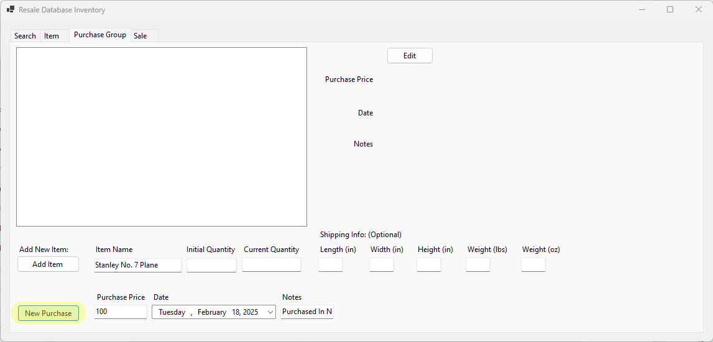
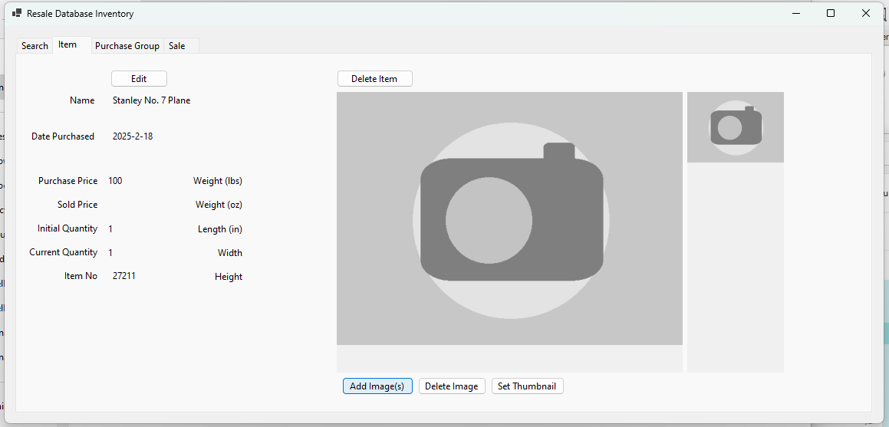
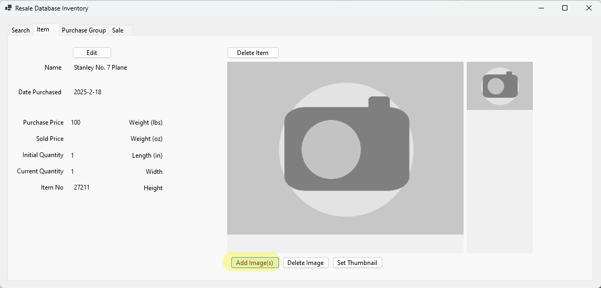
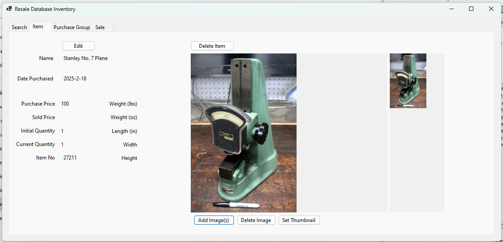
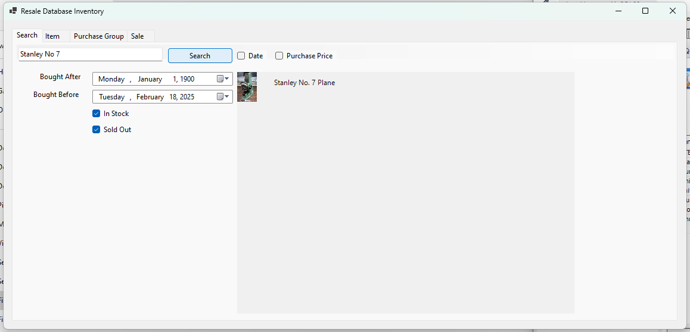

 
This program solves the problem resellers face in recording a complex inventory

# Table of Contents

* ### [**The Solution**](#the-solution)
* ### [**Tutorial**](#tutorial)
	* [Basic Understanding](#basic-understanding)
	* [Recording your first purchase](#recording-your-first-purchase)
* ### [**Installation**](#installation)

# The Solution
Suppose you buy a tool and resell it for a profit

Recording this in a spreadsheet is easy!
| Date | Name | Cost | Sold Date | Sold Val.| Profit |
|--|--|--|--|--|--|
| 5/4/2024 | Hammer Drill | $15 | 8/16/2024 | $125 | $110 |

But suppose you purchase dozens of items in only one lot.
And one item is a box that has 27 of the same type of bearing
All of which need to be sold individually
[Picture of lot of items]
Recording this can be a hassle with multiple spreadsheets interacting with each other

Now you can
* Enter simple items and their sale
* Enter large purchases and their multiple sales
* Search for your items by name
* Record all:
	* Purchases
	* Items
	* Sales
	* Pictures

## Tutorial

### Basic Understanding
For every purchase there may be multiple items (or just  1)
For every item there may be multiple sales (or just 1)

### Recording your first purchase
1. Click on the purchase tab
	 [Picture with purchase tab highlighted]
2. Enter required information
	* Purchase Price
	* Purchase Date
	* Name of the first item
	
3. Enter any other optional information
4. Press "New Purchase" to enter the purchase
	
5. Profit
   	
### Adding an image
1. With the item in the Item tab, click on Add Image and select the image(s) you'd like to add
		
2. Profit
		
   Image will even show up in a search for the item
   		
## Installation
1. MySQL is required store the data.
2. An install link can be found [here](https://dev.mysql.com/downloads/mysql/)
3. Included in the folder are SQL scrips used to set up the database backend
4. Using MySQL Workbench set up the username and password to be used in config
5. Run
